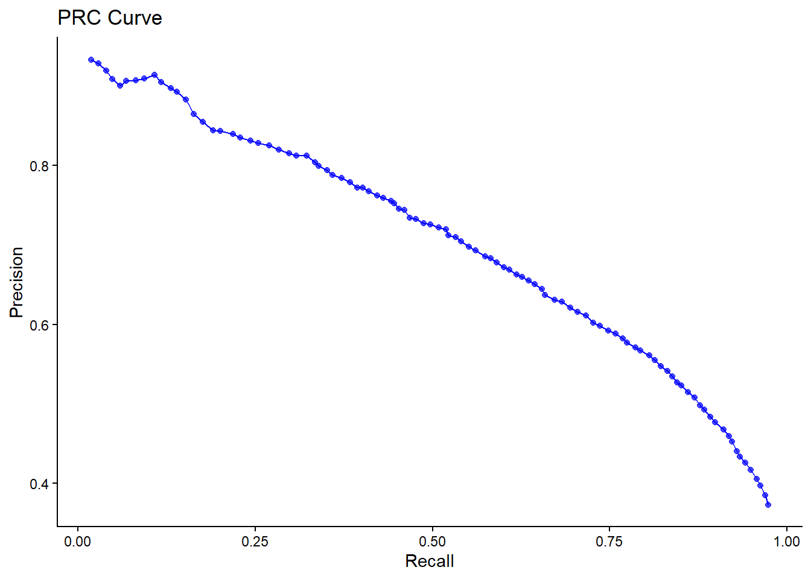

# m6APrediction
```
BIO215 Interim Report 3 Part 1
Donghan Li
2360973
```

## Table of Contents

1. [Introduction](#introduction)
2. [Installation](#installation)
3. [Minimal Example](#minimal-example)
4. [Model Performance](#model-performance)

## Introduction

m6APrediction is an R package for predicting m6A RNA modification sites using genomic features and a pre-trained Random Forest model.

## Installation

You can install the m6APrediction from GitHub using the `remotes` package:

```r
# install.packages("remotes")
remotes::install_github("elt17604/m6APrediction")
```

## Minimal Example

This example shows how to use the `prediction_multiple` function to predict m6A status on an example dataset included with the package.

```r
library(m6APrediction)

# 1. Load the pre-trained model
model_path <- system.file("extdata", "rf_fit.rds", package = "m6APrediction")
rf_model <- readRDS(model_path)

# 2. Load the example input data
data_path <- system.file("extdata", "m6A_input_example.csv", package = "m6APrediction")
example_data <- read.csv(data_path)

# 3. Run the prediction
predictions <- prediction_multiple(ml_fit = rf_model, test_data = example_data)

# View predictions
print(predictions)
```

## Model Performance

The performance of the pre-trained Random Forest model is summarized by the following ROC and PRC curves.

**ROC Curve**


**PRC Curve**

